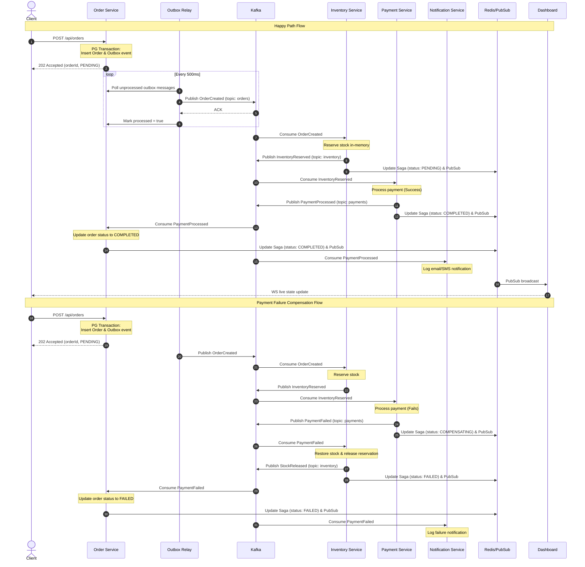

# Distributed Order Processing System — Architecture

## Overview
This system is a distributed, fault-tolerant e-commerce order processing engine built using the **Choreography-based Saga Pattern**. Rather than relying on a centralized orchestrator, services react asynchronously to events broadcasted over Apache Kafka. An **Outbox Pattern** is used inside the `order-service` to ensure atomic updates to the application database and outgoing events.

---

## Service Architecture & Ports

The system comprises the following components orchestrated via Docker Compose:

| Service Name | Port (External / Internal) | Technology Stack | Purpose |
| :--- | :--- | :--- | :--- |
| `zookeeper` | Internal Only | Apache Zookeeper | Manages Kafka cluster state |
| `kafka` | `9092:9092` | Apache Kafka | Event streaming broker and message log |
| `postgres` | `5432:5432` | PostgreSQL | Transactional store for Orders and Outbox table |
| `redis` | `6379:6379` | Redis | Saga state cache, pub/sub broadcaster, and idempotency key-value store |
| `order-service` | `8081:3001` | Node.js, Express, pg client | Exposes HTTP API for order creation, state query, and failure simulation |
| `outbox-relay` | Internal Health Port `3002` | Node.js, pg client, kafkajs | Polls PG Outbox table and publishes events to Kafka with strict ordering |
| `inventory-service`| Internal Only | Node.js, Redis client, kafkajs | Reserves/releases stock in-memory |
| `payment-service` | Internal Only | Node.js, Redis client, kafkajs | Processes payments, handles simulation-controlled failure rates |
| `notification-service` | Internal Only | Node.js, kafkajs | Logs email/SMS notification dispatches |
| `dashboard` | `8085:3005` | Node.js, Express, ws server | Visual dashboard featuring real-time WebSockets event logs |

---

## Event Flow Diagram

---

## Design Rationale
In a **Choreography-based Saga**, each service is decoupled and consumes events from other services to decide its own next course of action.
- **Decoupling**: No single component orchestrates the transaction. Services can scale independently.
- **Resiliency**: If one service goes down, events remain buffered in Kafka, and processing resumes once the service recovers.
- **Simplicity**: Avoids the overhead of managing a stateful orchestrator service, making it ideal for simple workflows.

---

## Failure Handling and Recovery
- **Idempotency**: All Kafka consumers check the uniqueness of `eventId` via Redis with a 24-hour TTL (`processed:<service>:<eventId>`).
- **Retries**: Network operations (Kafka, PostgreSQL, Redis) use exponential backoff retry.
- **Compensation**: In case of a downstream payment failure, `inventory-service` consumes `PaymentFailed` and triggers a rollback of the reserved stock (StockReleased).
- **Manual Operations**: Scripts like `service-restart.sh` and `payment-failure.sh` simulate failures and allow validating resiliency under failure scenarios.
- **State Machine & Status Logs**: Saga states are managed dynamically inside Redis under the key `saga:<orderId>` with the status (`PENDING`, `COMPLETED`, `COMPENSATING`, `FAILED`) and a chronological log of events (`history`).

### Dead Letter Queues (DLQs)
Explain the role of DLQs in this design:
- Which topics would have a corresponding DLQ (e.g., `orders.DLQ`, `inventory.DLQ`, `payments.DLQ`)
- When a message is routed to a DLQ (e.g., deserialization failure, repeated processing errors after N retries)
- How an operator would inspect and replay DLQ messages
- Note that DLQs are not fully implemented in the current codebase but are part of the production readiness plan

### Stuck Saga Recovery
Explain the strategy for handling a saga that stops progressing because a service dies permanently before publishing its event:
- Detection: a periodic reconciliation job (e.g., cron every 5 minutes) queries orders where status = PENDING or COMPENSATING and created_at is older than a threshold (e.g., 10 minutes)
- Recovery: re-publish the expected next event from the outbox table or trigger a manual compensation
- Timeout policy: after a configurable number of retries, mark the saga as DEAD and alert operators
- Note the trade-off: this introduces at-least-once redelivery, so all consumers must remain idempotent

---

## Outbox Pattern Implementation
To avoid inconsistencies due to dual-writes (where updating the DB succeeds but publishing to Kafka fails, or vice versa), the `order-service` writes both the order and an event payload into the same PostgreSQL database inside a single atomic transaction.
A lightweight, standalone `outbox-relay` polls the `orders_outbox` table every 500ms, publishes events to Kafka using an idempotent producer with partition key mapping to `orderId`, and commits the DB status once a Kafka acknowledgment (ACK) is received.
- **Trade-offs**: Simple polling introduces a tiny latency (up to 500ms) but avoids the complexity of installing and configuring Debezium, Kafka Connect, or writing complex triggers.
- **Health Check Integration**: Exposes a dedicated health HTTP server on port `3002` (serving `/health`) for reliable container orchestration health checks.

---

## HTTP API Endpoints

### Order Service (Port 8081 / Internal Port 3001)
- `POST /api/orders`: Create a new e-commerce order (initiates the Saga).
- `GET /api/orders`: Retrieve orders (primarily for health checks).
- `GET /api/sagas/:orderId`: Retrieve current Saga execution state and history for a given `orderId` from Redis.
- `POST /api/simulate/failure`: Configure simulated failure rates (e.g., setting the `payment` service failure rate to `1.0` in Redis).

### Dashboard (Port 8085 / Internal Port 3005)
- `GET /`: Serves the WebSockets-enabled live Saga monitoring UI dashboard.
- `GET /api/sagas/:orderId`: Retrieve current Saga execution state and history for a given `orderId`.
- `POST /api/simulate/failure`: Configure simulated failure rates.
