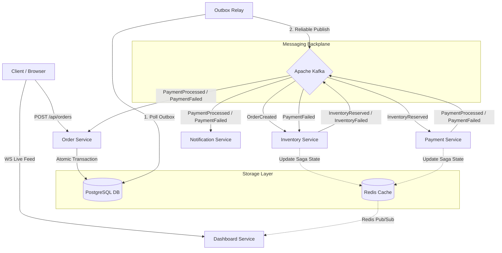
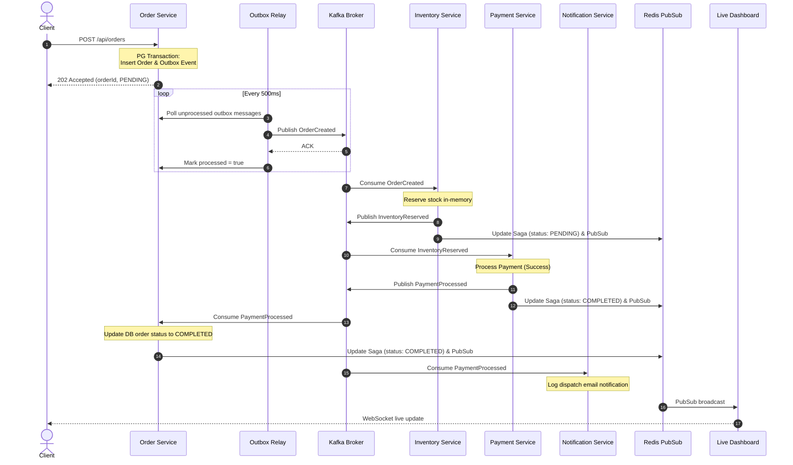
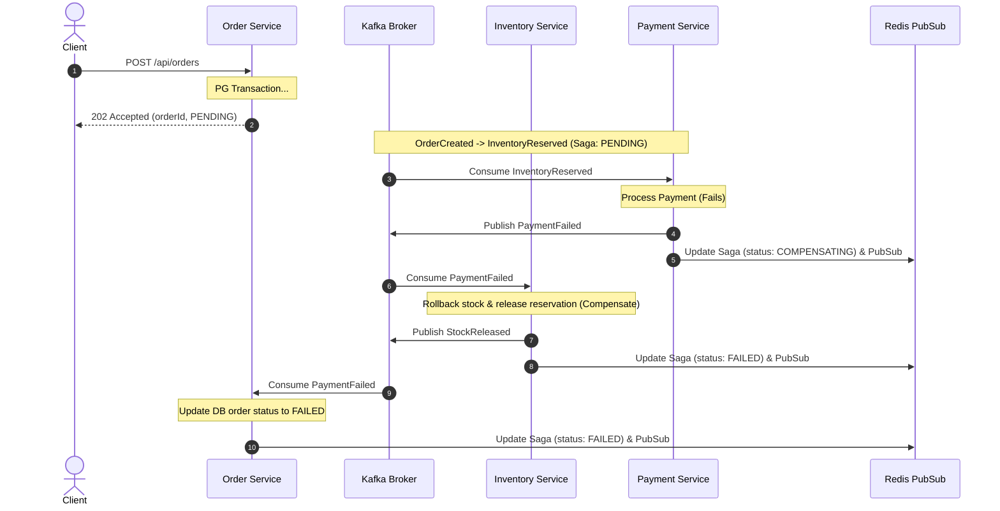

# SagaMesh: Choreography-based Saga E-Commerce System

SagaMesh is a distributed, fault-tolerant e-commerce order processing engine built using the **Choreography-based Saga Pattern** and the **Transactional Outbox Pattern**. The system ensures eventually consistent transactions across distributed microservices using Apache Kafka as the event backbone, PostgreSQL for transactional database persistence, and Redis for distributed state tracking, pub/sub signaling, and idempotency.

---

## 🏗️ Architecture & Component Design

The application consists of decoupled microservices that react asynchronously to domain events broadcasted over Kafka. No single orchestrator dictates the execution, preventing single points of failure.



---

## 🔄 Saga Flow & State Machine

### 1. Happy Path Flow
When a user places an order, the stock is reserved, payment is captured, and the order is marked completed.



### 2. Payment Failure Compensation Flow
If the payment processing fails (simulated or real), the system triggers compensating transactions to restore reserved inventory and mark the order as failed.



---

## 🛠️ Technology Stack

- **Runtime & Language**: Node.js, TypeScript (v5.4.5)
- **Database (OLTP)**: PostgreSQL (v15) - houses orders and transactional outbox table
- **Cache & State Store**: Redis (v7) - tracks Saga transaction history, handles idempotency checks, and distributes WebSockets updates
- **Event Streaming**: Apache Kafka (Confluent cp-kafka:7.5.0) - asynchronous message backplane
- **Web UI & Dashboard**: Vanilla HTML5, CSS3 Grid/Flexbox, Custom WebSockets client
- **Containerization**: Docker, Docker Compose

---

## 📡 API Endpoints

### 1. Order Service (`localhost:8081`)

#### Create Order
* **Endpoint**: `POST /api/orders`
* **Content-Type**: `application/json`
* **Request Body**:
  ```json
  {
    "customerId": "cust-909",
    "productId": "prod-101",
    "quantity": 3,
    "price": 49.99
  }
  ```
* **Response (202 Accepted)**:
  ```json
  {
    "orderId": "2c81e5ef-6a01-4803-9ea0-709a9bd3c264",
    "status": "PENDING"
  }
  ```
* **cURL Command**:
  ```bash
  curl -X POST http://localhost:8081/api/orders \
    -H "Content-Type: application/json" \
    -d '{"customerId":"cust-909","productId":"prod-101","quantity":3,"price":49.99}'
  ```

#### Get Saga Execution State
* **Endpoint**: `GET /api/sagas/:orderId`
* **Response (200 OK)**:
  ```json
  {
    "orderId": "2c81e5ef-6a01-4803-9ea0-709a9bd3c264",
    "status": "FAILED",
    "history": [
      {
        "service": "order",
        "event": "OrderCreated",
        "status": "SUCCESS",
        "timestamp": "2026-06-13T05:27:12.455Z"
      },
      {
        "service": "inventory",
        "event": "InventoryFailed",
        "status": "FAILURE",
        "timestamp": "2026-06-13T05:27:12.562Z"
      },
      {
        "service": "order",
        "event": "InventoryFailed",
        "status": "FAILURE",
        "timestamp": "2026-06-13T05:27:12.568Z"
      }
    ]
  }
  ```
* **cURL Command**:
  ```bash
  curl -s http://localhost:8081/api/sagas/2c81e5ef-6a01-4803-9ea0-709a9bd3c264
  ```

#### Simulate Payment Failure
* **Endpoint**: `POST /api/simulate/failure`
* **Content-Type**: `application/json`
* **Request Body**:
  ```json
  {
    "service": "payment",
    "failureRate": 1.0
  }
  ```
* **Response (200 OK)**:
  ```json
  {
    "service": "payment",
    "failureRate": 1.0,
    "updated": true
  }
  ```
* **cURL Command**:
  ```bash
  curl -X POST http://localhost:8081/api/simulate/failure \
    -H "Content-Type: application/json" \
    -d '{"service":"payment","failureRate":1.0}'
  ```

---

### 2. Live Dashboard (`localhost:8085`)

- **Web Portal**: `GET /` - Opens the interactive visual portal monitoring active orders, state history, and failure simulation controls.
- **WebSocket Channel**: `ws://localhost:8085/ws/sagas` - Streaming live updates.
- **Get Saga Endpoint**: `GET /api/sagas/:orderId` - Fetches status (duplicated on dashboard for UI queries).
- **Simulate Failure**: `POST /api/simulate/failure` - Sets failure simulation configurations in Redis.

---

## 🚀 Running the Project

### 1. Build and Run Container Suite
Execute the following command to spin up Kafka, Zookeeper, PostgreSQL, Redis, and all Node.js microservices:
```bash
docker-compose up -d --build
```

### 2. Verify System Health
Check container state until all services report healthy:
```bash
docker-compose ps
```

### 3. Run Failure Scenarios
To simulate a 100% payment failure rate and watch the Compensation flow trigger live:
```bash
bash scripts/payment-failure.sh
```

To reset the failure rate back to normal:
```bash
curl -X POST http://localhost:8081/api/simulate/failure \
  -H "Content-Type: application/json" \
  -d '{"service":"payment","failureRate":0.0}'
```
